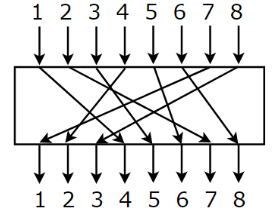
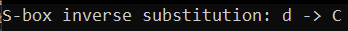
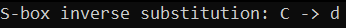

# SPboxes

SPboxes is an C++ implementation example of Substitution and Permutation boxes
used in symmetric key algorithms.

## About

S and P boxes are both work with 8-bit input values and return 8-bit result.

Another feature of this implementation is auto-creation of inverse S and P box
i.e. all you need to do is create your own substitution or permutation table in
the corresponding header file (or use the default) and then, if you use boxes in decryption, just call *inverseS(P)box* function.

The default S-box is taken from [AES algorithm](https://en.wikipedia.org/wiki/Rijndael_S-box).

The default P-box is randomly created by me:

<p align="center">
  
</p>

## Installation

To start using this implementation clone repository and use files in **src** folder in your project.

## Examples

### Substitution
To substitute, you need to call *substitute(uint8_t data)* function;

```C++
	uint8_t c1 = 'd'; //0x64
	uint8_t c2 = substitute(c);
	std::cout << "S-box substitution: " << c1 << "->" << c2 << std::endl;
```

According to S-box, the result of this substitution is **0x43** which is 'C' is ASCII table:
<p align="center">
  
</p>

### Inverse substitution
For the inverse substitution you need to create inverse S-box using *inverseSbox(vector<vector<uint8_t>>& InvSbox)* function. After that, you will be able to use *invSubstitute(uint8_t data, vector<vector<uint8_t>>& InvSbox)* for decrypt:

```C++
	std::vector<std::vector<uint8_t>> InvSbox;
	inverseSbox(InvSbox);
	uint8_t c1 = 'C'; //0x43
	uint8_t c2 = invSubstitute(c1, InvSbox);
	std::cout << "S-box inverse substitution: " << c1 << " -> " << c2 << std::endl;
```
<p align="center">
  
</p>

### Permutation

Syntax of permutation is the same as substitution. The only difference is call *permutate(uint8_t data)* instead of *substitute*.

### Inverse permutation

Syntax of inverse permutation is the same as substitution. You need to call *inversePbox(vector<short>& InvPbox);* for create inverse P-box and then use *invPermutate(uint8_t data, vector<short>& InvPbox);* to decrypt.

### Common usage

To encrypt or decrypt some message, you can pass this string symbol by symbol to permutation or substitution functions and append result to another string. You can also combine permutation and substitution multiple times as you wish. For example:

```C++
std::string message = "Encrypt this message", temp, encrypted;
for (size_t i = 0; i < message.size(); i++)
{
	temp += substitute(message[i]);
}
for (size_t i = 0; i < temp.size(); i++)
{
	encrypted += permutate(temp[i]);
}
```
